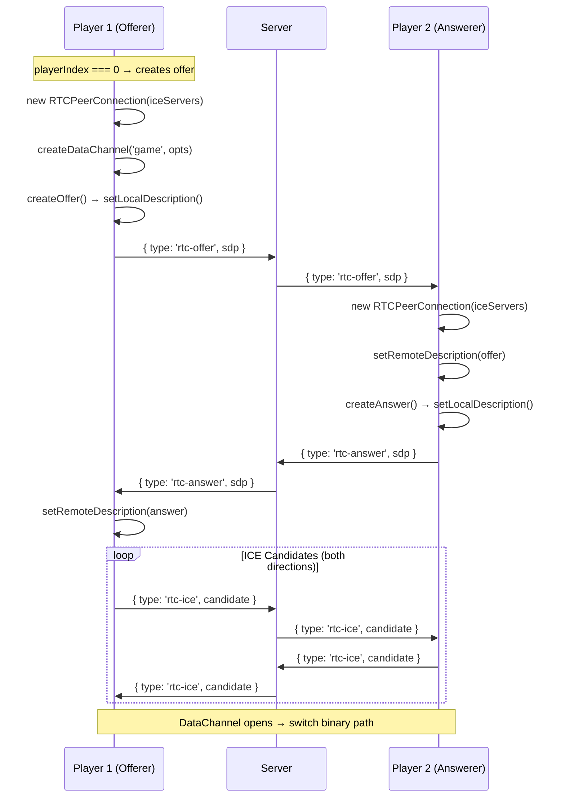
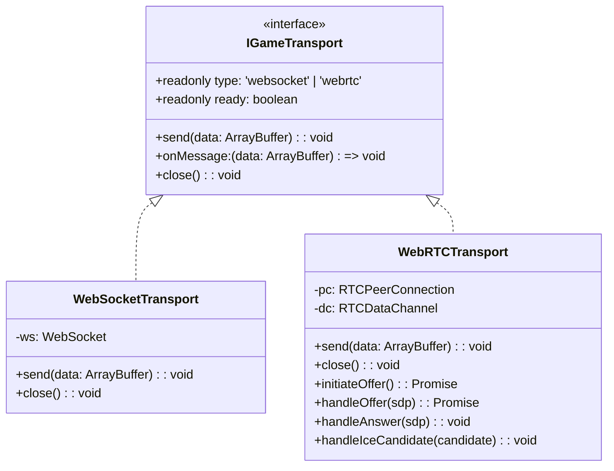
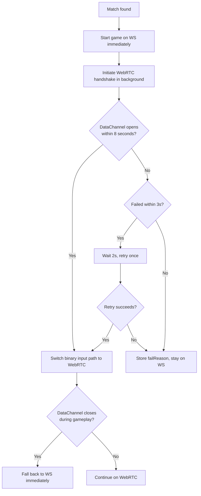

# H4KKEN — WebRTC Migration Technical Design

> **Purpose**: Technical specification for adding WebRTC DataChannel as preferred transport alongside existing WebSocket.

## Overview

WebRTC DataChannels provide UDP-like semantics (`ordered: false, maxRetransmits: 0`) that eliminate TCP head-of-line blocking. For a fighting game with GGPO rollback netcode, lost packets are handled by the prediction system — they don't need retransmission.

## Signaling Protocol

WebRTC requires a signaling channel to exchange SDP offers/answers and ICE candidates. The existing WebSocket connection serves as this channel.

### New Server Message Types

```typescript
// Client → Server (relayed to opponent in same room)
{ type: 'rtc-offer', sdp: string }    // SDP offer from playerIndex=0
{ type: 'rtc-answer', sdp: string }   // SDP answer from playerIndex=1
{ type: 'rtc-ice', candidate: string } // ICE candidate (both players)
```

The server **does not process** SDP or ICE — it only relays messages between matched players.

### Handshake Flow



## DataChannel Configuration

```typescript
const dataChannel = peerConnection.createDataChannel('game', {
  ordered: false,       // No ordering guarantee (UDP semantics)
  maxRetransmits: 0,    // Never retransmit lost packets
});
dataChannel.binaryType = 'arraybuffer';
```

**Why these settings?**
- `ordered: false` — Prevents head-of-line blocking. Out-of-order packets are delivered immediately.
- `maxRetransmits: 0` — Lost packets are gone. The rollback system handles the missing frame via prediction.
- Combined: True fire-and-forget UDP semantics over SCTP.

## ICE Server Configuration

### Multi-Provider STUN Pool

Instead of relying on a single provider (Google), h4kken uses a diversified STUN server pool with latency-based selection (`IceServerPool.ts`). This improves resilience against regional outages and picks the fastest server for each user:

| Provider   | URL                                   | Notes                                    |
|------------|---------------------------------------|------------------------------------------|
| Google     | `stun:stun.l.google.com:19302`        | Most well-known, high availability       |
| Google     | `stun:stun1.l.google.com:19302`       | Secondary Google endpoint                |
| Cloudflare | `stun:stun.cloudflare.com:3478`       | Global anycast, low latency              |
| Mozilla    | `stun:stun.services.mozilla.com:3478` | Operated by Mozilla Foundation           |
| Twilio     | `stun:global.stun.twilio.com:3478`    | Enterprise-grade, global PoPs            |

**Probe algorithm** (runs once per session, cached):

1. Create one ephemeral `RTCPeerConnection` per STUN server
2. Create a dummy DataChannel to trigger ICE gathering
3. Measure time-to-first `icecandidate` event (~= STUN round-trip)
4. Sort by response time, return top 3
5. Merge with TURN credentials from server (if configured)

If probing fails (e.g. `RTCPeerConnection` unavailable), the full unprobed list is used as fallback. The probe is triggered on WebSocket connect (before any match) so results are cached by match time.

### TURN + STUN Combined

```typescript
const iceServers = [
  // Probed STUN (top 3 by latency from IceServerPool)
  { urls: 'stun:stun.cloudflare.com:3478' },     // fastest
  { urls: 'stun:stun.l.google.com:19302' },       // 2nd
  { urls: 'stun:global.stun.twilio.com:3478' },   // 3rd
  // Self-hosted TURN (relay for symmetric NAT / corporate firewalls)
  {
    urls: [
      'turn:realm:3478?transport=udp',
      'turn:realm:3478?transport=tcp',
      'turns:realm:5349?transport=tcp',
    ],
    username: '1713225600:h4kken',   // ephemeral, 24h TTL
    credential: '<HMAC-SHA1>',        // from /api/turn-credentials
  },
];
```

### Why TURN is Needed

STUN alone works for ~80% of NAT configurations. The remaining ~20% (symmetric NAT, common on mobile carriers and corporate networks) require TURN relay. For Mexico ↔ Germany play:

| NAT Type | STUN | TURN |
|----------|------|------|
| Full Cone | ✅ | ✅ |
| Restricted Cone | ✅ | ✅ |
| Port Restricted | ✅ | ✅ |
| Symmetric | ❌ | ✅ |

## Transport Abstraction



## Fallback Strategy



**Key principles**:
- The game **never waits** for WebRTC. WS works from frame 1.
- WebRTC is a background upgrade that happens transparently.
- One automatic retry on fast failure (< 3s) with 2s cooldown.
- `failReason` is stored and displayed in the F3 debug overlay.

## Connection Diagnostics (F3 Overlay)

Press **F3** during an online match to see live diagnostics:

| Line | Example | Description |
|------|---------|-------------|
| Transport | `Transport: WEBRTC` | Active binary transport |
| WebRTC status | `WebRTC: ✓ CONNECTED (direct)` | Connection state + relay indicator |
| ICE state | `ICE: connected  Gathering: complete` | ICE connection & gathering states |
| Candidate types | `Candidate: srflx → srflx` | Local → remote candidate types |
| P2P RTT | `P2P RTT: 42ms` | Actual WebRTC round-trip (from `getStats()`) |
| DC buffer | `DC Buffer: 0B  Lost: 3` | DataChannel backpressure + packet loss |

**WebRTC status values**:
- `✓ CONNECTED (direct)` — P2P connection via STUN (best case)
- `✓ CONNECTED (relay/TURN)` — Relayed through TURN server
- `⟳ CONNECTING (checking)` — ICE negotiation in progress
- `✗ FAILED (reason)` — Shows specific failure reason:
  - "Browser does not support WebRTC"
  - "Handshake timeout (8s)"
  - "ICE connection failed (no route to peer)"
  - "DataChannel error: ..."

**Candidate types** (RFC 8445 §4.1.1.1):
- `host` — Direct connection on a local interface
- `srflx` — Server-reflexive (NAT traversed via STUN)
- `prflx` — Peer-reflexive (discovered during connectivity checks)
- `relay` — Traffic relayed through TURN server

### getStats() Polling

The F3 overlay polls `RTCPeerConnection.getStats()` every ~1 second to extract:
- `currentRoundTripTime` from the nominated `candidate-pair` stat
- `packetsLost` and `packetsSent`
- `availableOutgoingBitrate`
- Local and remote `candidateType`

Polling only happens when F3 is visible — zero performance cost in normal gameplay.

## What Stays on WebSocket

| Message | Why WS |
|---------|--------|
| `join`, `matched`, `waiting` | Pre-match, no DataChannel yet |
| `countdown`, `fight` | Server-driven state, needs reliability |
| `roundResult` | Must be reliably delivered (determines match outcome) |
| `ping`/`pong` | RTT measurement (works on either, but WS is always available) |
| `superActivated` | Rare event, needs reliability |
| `rtc-offer/answer/ice` | Signaling messages |

## What Moves to WebRTC DataChannel

| Message | Why DC |
|---------|--------|
| Binary `syncInput` (8 bytes) | Sent 60 times/sec, loss-tolerant (rollback handles it) |
